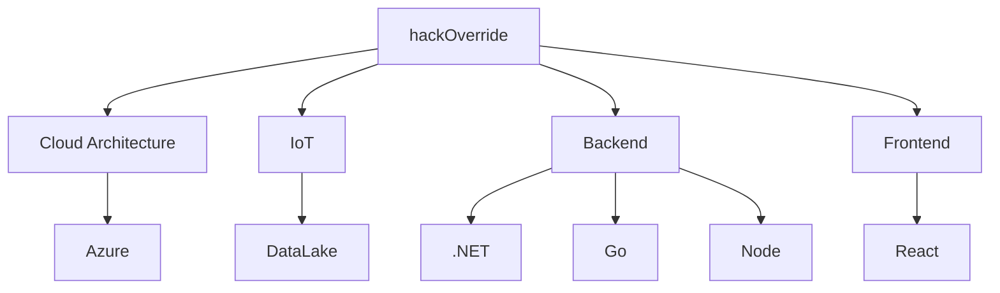

# Hi there, I'm Hackoverride 👋

Welcome to my GitHub profile! I love solving complex problems with easy to understand, creative and efficient solutions.

## My programming mantra

Represented best by a Quote from Donald Knuth:
> The best programs are written so that computing machines can perform them quickly 
> and so that human beings can understand them clearly.
> > Donald Knuth
