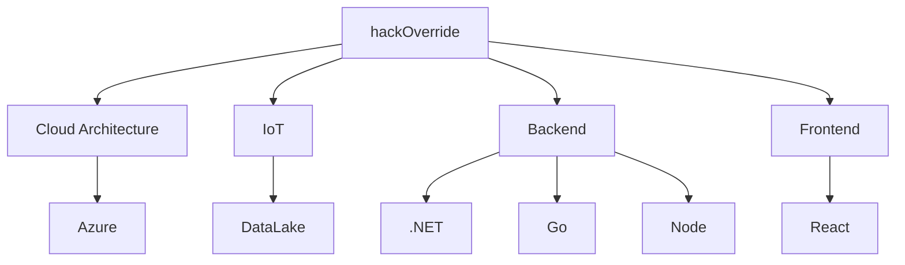

# Hi there, I'm Hackoverride 👋

Welcome to my GitHub profile! I love solving complex problems with easy to understand, creative and efficient solutions.

## My programming mantra

> "The best programs are written so that computing machines can perform them quickly, and human beings can understand them clearly."
> *Donald Knuth*

A great programmer is like an essayist, blending aesthetics, structure, and logic. Knuth reminds us that coding isn’t just about getting to the solution—it’s about crafting code that communicates, convinces, and endures.
