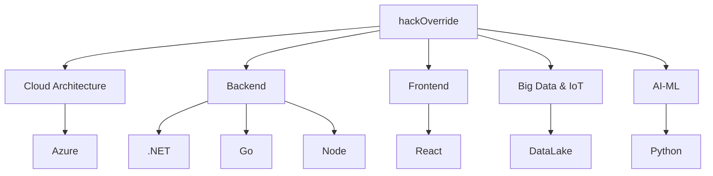

# Hi there, I'm Hackoverride 👋

*A great solution fades into the background, letting users focus solely on their goals, not the system.*

I love solving complex problems with Easy to Understand, Creative and Efficient solutions.

I identify as code-agnostic but if I had to pick my go-to languages, here they are:

I do .NET C# for Enterprise, Go for Concurrency and Speed, Node for Simple applications, WebSockets and MVPs. Python for anything statistical or Math related.
Rust for anything where you have more time but need one part of a system to run faster. 

> I believe that one should always use the right tool for the job - even if it is a monolithic beast or loosely coupled micro-architectured solution(s). The tools as in a language should always concider the possible *Risks* and *Future Technical Debt*.

Frontend I do Vanilla, React, Vue and Angular but I find React and the components to be easiest to work with over many different projects. I tend to like Atomic Design patterns with SCSS/SASS.
Databases I have completed professional projects with Data Lake, MongoDB, and many of the SQL solutions. 

## My programming mantra

> "The best programs are written so that computing machines can perform them quickly, and human beings can understand them clearly."
> *Donald Knuth*
